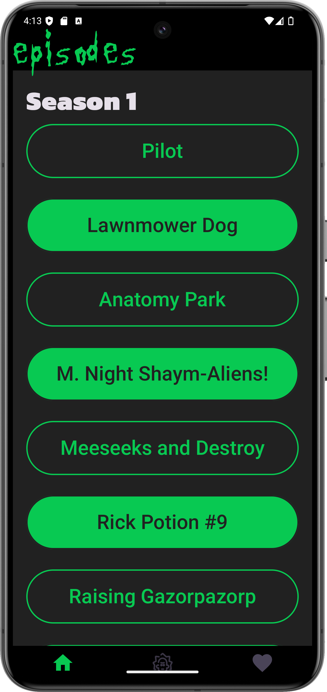
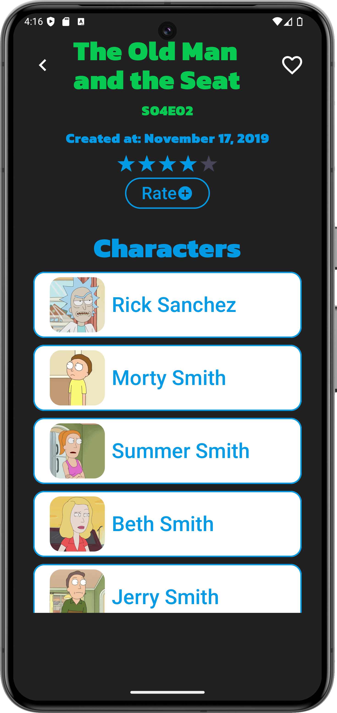
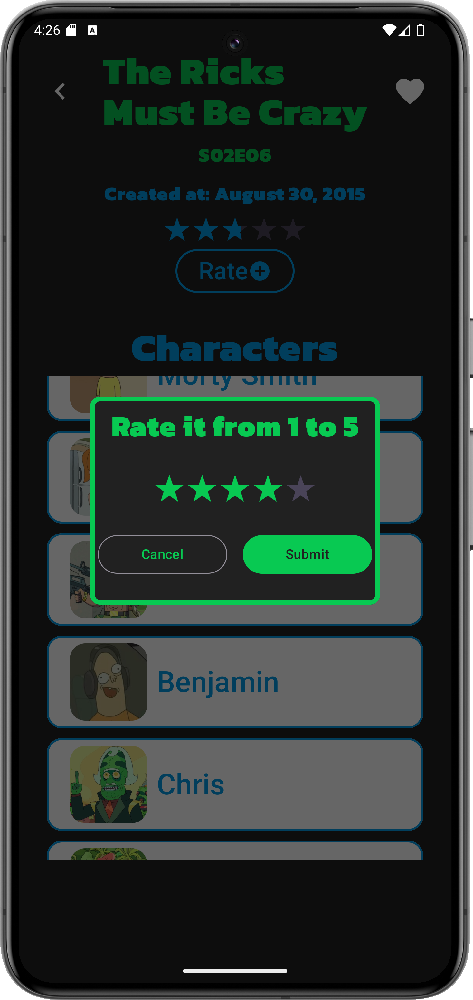
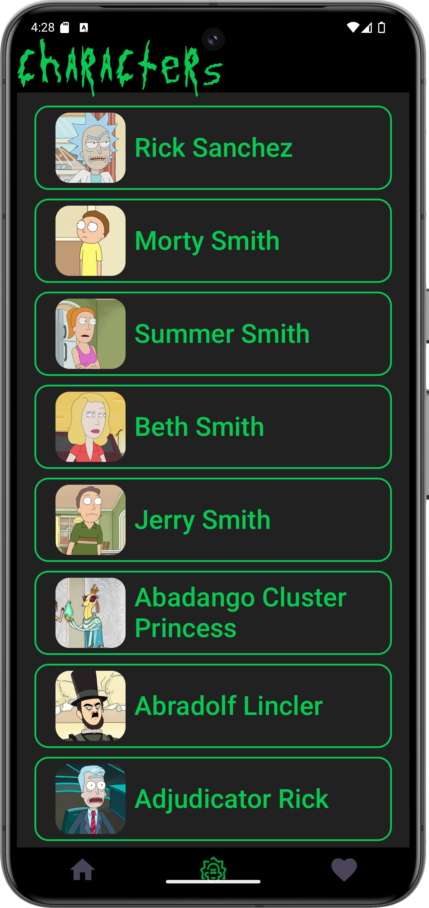
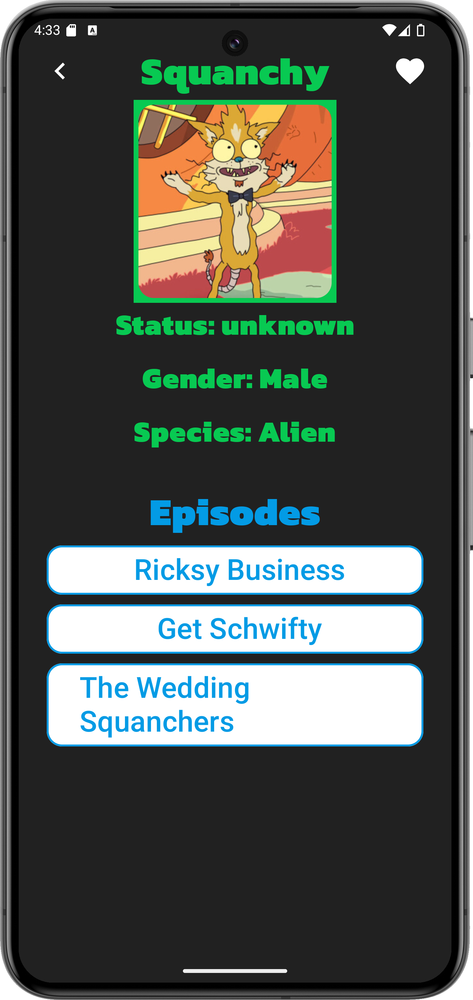
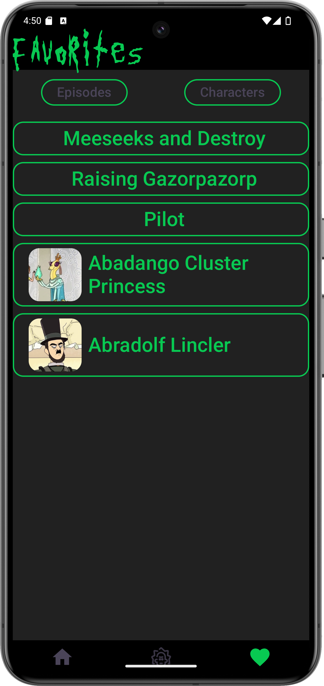
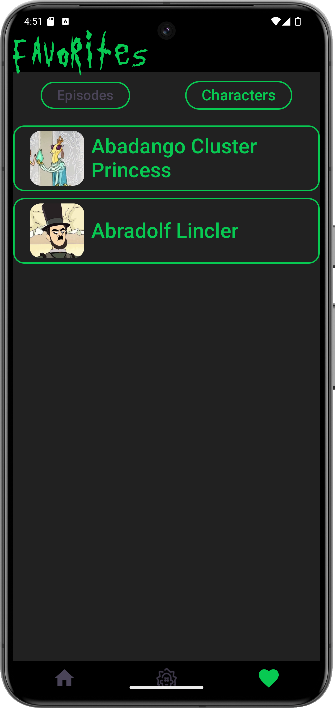
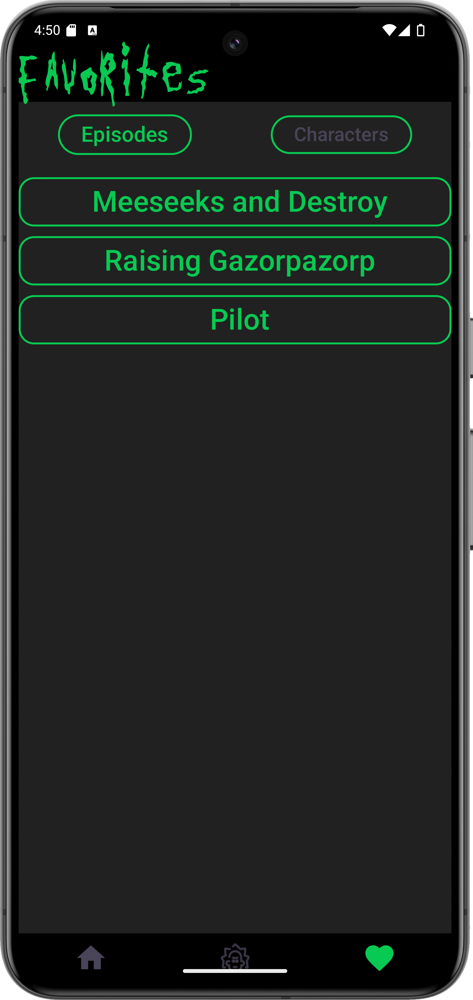
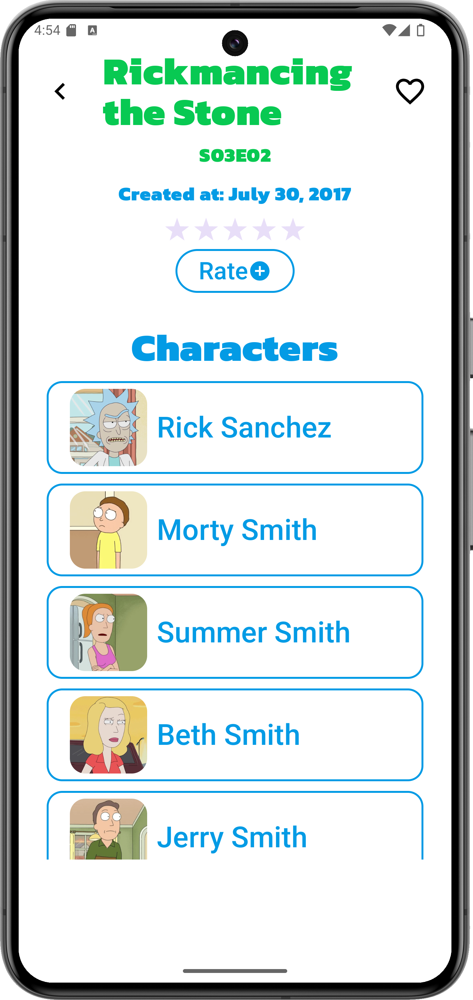
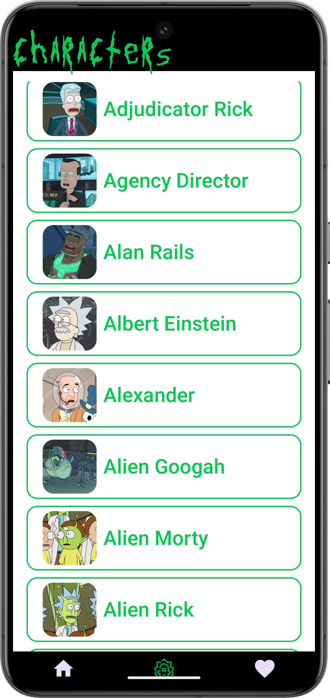

## Androidalapú szoftverfejlesztés
___

### RickiverseMortinfo

## Bemutatás

Az alkalmazás a Rick and Morty című sorozat epizódjai és karakterei között segít eligazodni.
Segít mutatni egy átfogó képet az epizódokról és a karakterekről, azáltal, hogy összegzi a legfontosabb tudnivalókat róluk.
Segíthet azoknak, akik belezavarodtak a számtalan karakter tengerébe vagy éppen nem találják kedvenc részüket.

## Főbb funkciók

### Epizódok
- Az alkalmazás képes megjeleníteni az elérhető epizódokat listás formában.
- Egy epizód részleteinek megtekintésére is van lehetőség. Ez a következő adatokat foglalja magába (amennyiben elérhetőek): cím, évad és epizód száma, megjelenés dátuma, értékelés, a részben szereplő karakterek listája.
- Az epizód részletes oldalán lehetőség van egy 10-es skálán értékelni az adott részt. Az adott pontszám beleszámít a részletes oldalon megjelenített összpontszámába.

### Karaktrek
- Az alkalmazásban lehetőség van keresni a sorozat karakterei között név alapján. A találatokat listás formában jeleníti meg képpel (ha elérhető) és teljes névvel.
- Lehetőség van a karakter részletes oldalának megtekintésére is. Ez a következőket tartalmazza (amennyiben elérhetőek): név, kép, státusz, faj, nem és epizódok, amiben szerepelt.

### Kedvencek
- Mind az epizódokat mind a karaktereket lehetőség van felvenni a kedvencek listájára, így az alapján könnyebben megtalálhatókká válnak.
- A kedvencek oldalon szűrni lehet külön a karakterekre és az epizódokra.

## Felhasználói kézikönyv

Az alkalmazás három főbb oldallal rendelkezik. Ezek:
- Episodes (Epizódok listája)
- Characters (Karakterek listája)
- Favorites (Kedvenc epizódok és karakterek)
Ezek az oldalak egységesen rendelkeznek egy címsávval a képernyő tetején, ami mutatja melyik oldal van éppen használatban. Ezen oldalak alján pedig navigációs sáv található, amire kattintva át lehet térni egy másik főbb oldalra. Az aktuális oldal mindig ki van emelve eltérő színnek.

### Epizódok ###

Az alkalmazás elindítását követően az epizódokat megjelenítő oldal fog először megjelenni. Az oldalon a részek nevei láthatóak buborékokban. A részek a megjelenés dátuma alapján növekvő sorrendben töltődnek be. Az évadváltások között az adott évad száma található. Valamelyik buborékra történő kattintás során az alkalmazás átnavigál az epizód részletes oldalára.

### Epizód ###

Az epizód oldalon egy adott rész adatai jelennek meg. Legfelül kiemelve a cím, majd alatt kicsivel az évad és rész sorszáma (pl: S2E6 = Második évad hatodik rész). Az oldalon látszik még az is, hogy mikor jelent meg az epizód. Az oldal legalján a részben szereplő karalterek kerülnek felsorolásra. Ezekre kattintva át lehet navigálni a karakter részletes oldalára.
A bal felső sarokban található nyíllal lehet visszajutni az előző oldalra.
A jobb felső sarokban található szív indikálja, hogy az epizód a kedvencek közé van-e adva. Amennyiben igen a szív telített, ha nem akkor pedig üres. Ennek az állapota rákattintással változtatható.
A Rate- gombra kattintva megjelenik egy ablak, ahol saját értékelés küldhető a csillagokra kattintva.
Az oldal görgethető, hogy biztosan minden tartalom kiférjen rá.

### Karakterek ###

A karakterek megjelenítő oldalon a karakterek vannak egymás alatt vannak felsorolva. Adott karakterre kattintva megnyílik a karakter részletes oldala.

### Karakter ###

A karakter részletes oldalán elolvasható a karakter fontosabb adata (neve, faja, neme, státusza, epizódok, amelyekben szerepelt). Az epizódra kattintva megnyílik az epizód részletes oldala. A bal felső sarokban található nyíllal lehet visszajutni az előző oldalra.
A jobb felső sarokban található szív indikálja, hogy az epizód a kedvencek közé van-e adva. Amennyiben igen a szív telített, ha nem akkor pedig üres. Ennek az állapota rákattintással változtatható.

### Kedvencek ###

A kedvencek oldalon megtalálhatóak a felhasználó által bekedvelt karakterek és epizódok jelennek meg. Ezekre kattintva megnyílik a részletes oldaluk. A lista felett található két gomb, az egyik az "Episodes" a másik pedig a "Characters". A "Characters" gombra kattintva a gomb színe megváltozik és csak a karakterek lesznek megjelenítve. Még egyszer rákattintva a gomb elszürkül és újra látható az összes kedvenc. Az "Episodes" gomb is hasonlóan működik, viszont az csak epizódokra

### Amennyiben a telefon világos módban van használva az alkalmazás egy világosabb hatás próbál kelteni. ###

## Felhasznált technológiák:

- **Retrofit** könyvtár használata a internetes api [rickandmortyapi.com/api/](https://rickandmortyapi.com/api/) használatához
- **Room** könyvtár használata a kedvenc karakterek és epizódok perziszents eltárolásához **SQLite** adatbázisban
- Az epizódokra beküldött értékelések a **Firebase-Firestore** segítségével kerülnek eltárolásra, és valós időben frissítődnek
- A felhasználó felület stílusa **MaterialTheme** segítségével lett megvalósítva
- **ComposeRateBar** ([github.com/a914-gowtham/compose-ratingbar](https://github.com/a914-gowtham/compose-ratingbar)) külső könyvtár használata az epizódok értékelések vizualizálásának megvalósításához

## Fontosabb technológiai megoldások

### Valód idejű értékelés ###

Az elsőre legnehezebbnek tűnő kihívás számomra az volt, hogy az epizód értékelésekre valós időben frissítse a rész pontszámát. Azonban kisebb gondolkodást követően a megoldás eléggé adta magát és közel sem jelentett akkora problémát, mint elsőre gondoltam. Azt semmiképpen nem szerettem volna, hogy manuálisan állítsam be a módosított értéket vagy minden értékelés után indítok egy lekéredezést is, hogy biztos lehessek benne, hogy sikeres volt a művelet. Ezért a FireStore által nyújtott valós idejű szolgáltatásokat használom. Ez abban mutatkozik meg, hogy egy egyszerű lekérés helyett egy snapshot listerner-t alkalmaztam, amely a megfigyelt dokumentum változtatásakor elküldi az applikációnak módosított adatokat. A függvény, amely ezt a funkciót kezeli (FireBaseEpisodeRatingService) egy nullable Rating típusú Flow-t vár paraméterül. Mindig, amikor egy epizód-ra új értékelés érkezik be az Flow frissítőik az új adattal. A viewmodel ugyan ezt a flow-t használja, így a Ui is frissül az esemény hatására.